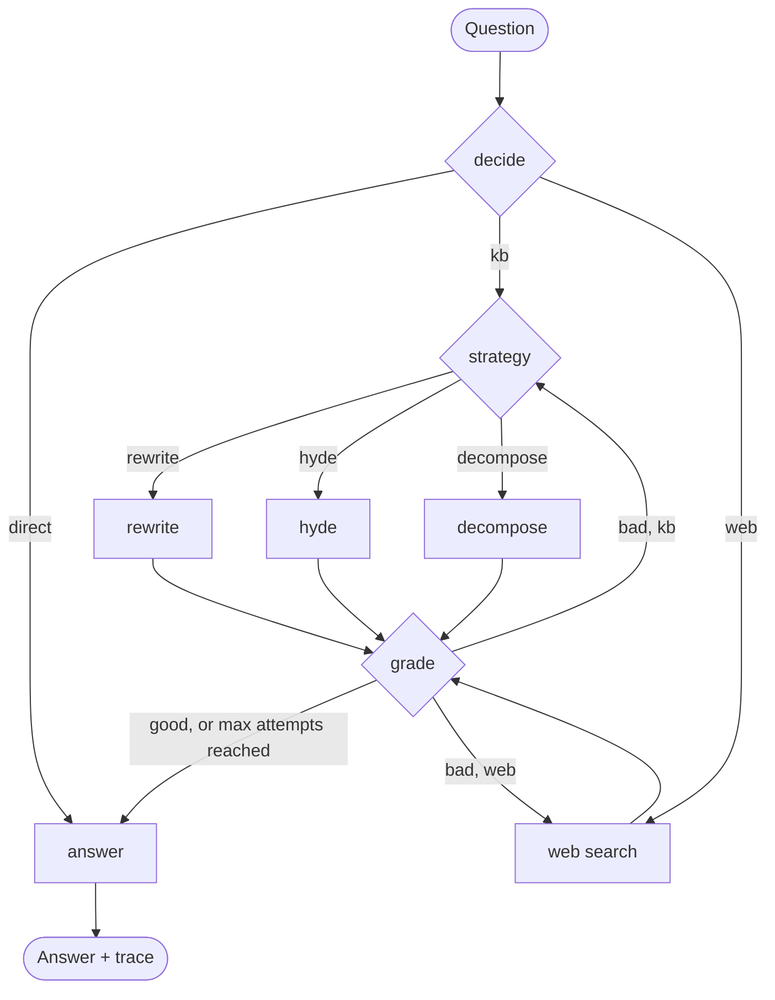

# RAG Agent with LangGraph

An self-RAG agent built with [LangGraph](https://github.com/langchain-ai/langgraph). Instead of always retrieving and answering in one fixed pass, the agent **decides** where an answer should come from, **picks a search strategy**, **grades** what it found, and **retries** with a different approach when the results are not good enough.

The demo knowledge base is a small fictional company handbook (Northwind), but the same pipeline works with any PDF.

---

## What it does

For every question, the agent runs this loop:

1. **Route**: answer directly, search the PDF knowledge base, or search the live web.
2. **Choose a strategy** (knowledge base only): `rewrite`, `hyde`, or `decompose`.
3. **Retrieve** the top-k chunks from ChromaDB (or from Serper for web questions).
4. **Grade** the chunks. If key facts are missing, go back and try again (up to `MAX_ATTEMPTS`).
5. **Answer** with citations: page numbers for the handbook, URLs for web results.

### Search strategies

| Strategy | When it helps | What it does |
|---|---|---|
| `rewrite` | Chatty or vague questions | Turns the question into a short keyword query |
| `hyde` | Questions that don't match the document's wording | Writes a fake answer in the document's style and searches with it |
| `decompose` | Multi-part or comparison questions | Splits the question into 2 to 4 sub-queries |

On a retry, the agent is told which strategy already failed and must pick a different one.

---

## Architecture



Every run also returns a `trace` listing each step the agent took, which makes the routing decisions easy to inspect.

---

## Tech stack

- **Orchestration:** LangGraph
- **LLM:** `openai/gpt-oss-120b` served through Groq's OpenAI-compatible endpoint (via `langchain-openai`)
- **Vector store:** ChromaDB with its built-in ONNX `all-MiniLM-L6-v2` embeddings (no PyTorch needed)
- **PDF parsing:** PyMuPDF
- **Chunking:** `RecursiveCharacterTextSplitter` (800 characters, 120 overlap)
- **Web search:** [Serper](https://serper.dev)

---

## Getting started

### Requirements

- Python 3.14 (the pinned versions in the notebook were tested on it)
- A [Groq API key](https://console.groq.com)
- A [Serper API key](https://serper.dev) (only needed for web questions)

### Run locally

```bash
git clone https://github.com/<your-username>/<your-repo>.git
cd <your-repo>

python -m venv .venv
source .venv/bin/activate        # Windows: .venv\Scripts\activate
pip install -r requirements.txt

cp .env.example .env             # then fill in your keys
jupyter notebook Self_RAG_LangGraph.ipynb
```

### Run in Google Colab

1. Open the notebook in Colab.
2. Add `GROQ_API_KEY` and `SERPER_API_KEY` under **Secrets** and enable notebook access.
3. Upload `data/company_handbook.pdf` to `/content/`.
4. Run all cells.

### Environment variables

| Variable | Required | Description |
|---|---|---|
| `GROQ_API_KEY` | Yes | Key for the Groq API |
| `SERPER_API_KEY` | For web search | Key for serper.dev |
| `MODEL_NAME` | No | Overrides the default model (`openai/gpt-oss-120b`) |

---

## Configuration

These knobs are at the top of the notebook:

| Name | Default | Meaning |
|---|---|---|
| `PDF_PATH` | `data/company_handbook.pdf` | PDF to index |
| `K` | `4` | Chunks returned per search |
| `MAX_ATTEMPTS` | `2` | Retrieval attempts before the agent answers anyway |

---

## Example run

| Question | Route | Strategy | Result |
|---|---|---|---|
| `hi` | direct | none | Plain greeting, no retrieval |
| `what is 2+2` | direct | none | Answers from general knowledge |
| `how many vacation days can I carry over?` | kb | rewrite | Up to 5 days, cited from the handbook |
| `compare the 2022 and 2023 carryover rules` | kb | rewrite | Side-by-side comparison with page citations |
| `who won the 2024 US election?` | web | none | Answer with a source URL |

---

---

## License

Add a license of your choice, for example [MIT](https://choosealicense.com/licenses/mit/).
